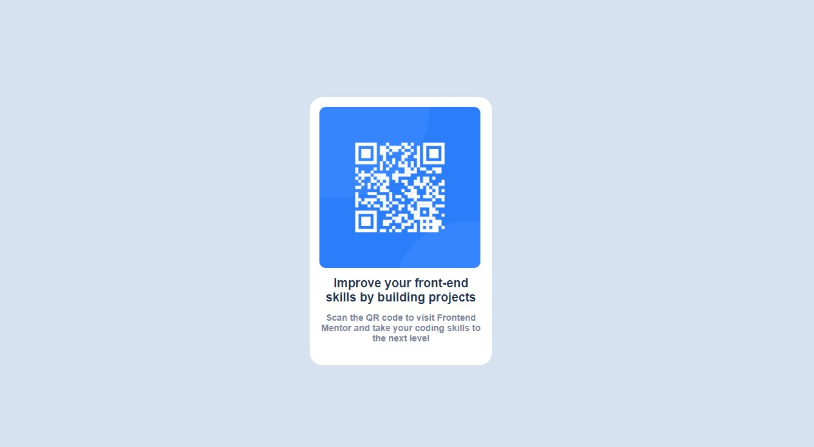

# Frontend Mentor - solução de componente de código QR

Esta é uma solução para o [desafio do componente de código QR no Frontend Mentor](https://www.frontendmentor.io/challenges/qr-code-component-iux_sIO_H). Os desafios do Frontend Mentor ajudam você a melhorar suas habilidades de codificação criando projetos realistas.

## Visão geral

### Captura de tela

### Links

- URL da solução: [Adicionar URL da solução aqui](https://your-solution-url.com)

## Meu processo

### Construído com

- Marcação HTML5 semântica
- Propriedades personalizadas CSS

### Desenvolvimento contínuo

Eu gostaria de me aprofundar no posicionamento de objetos em css

## Autor
- github - [KaiqueOliveira](https://github.com/k5364)
- Frontend Mentor - [@k5364](https://www.frontendmentor.io/profile/k5364)